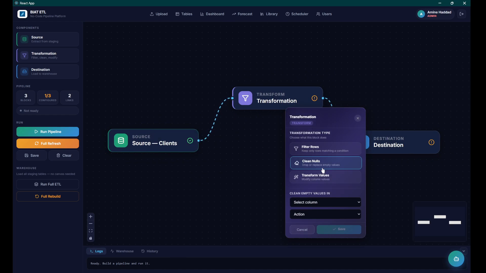
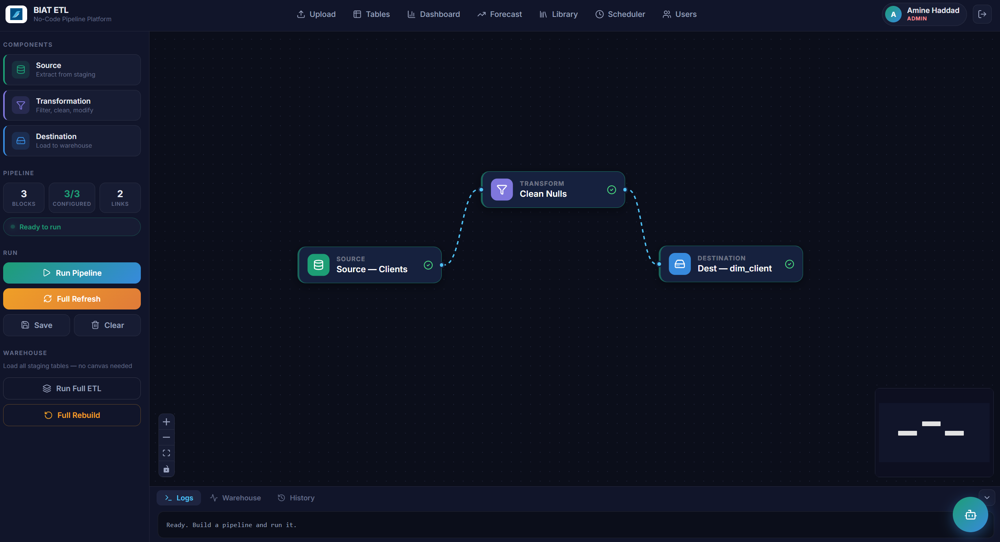
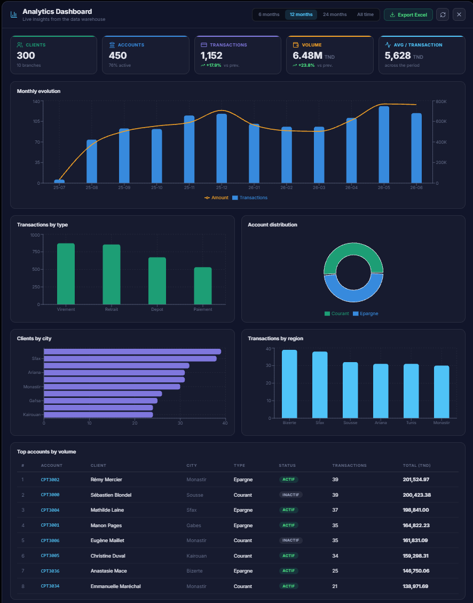
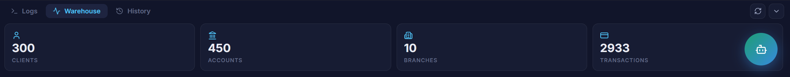
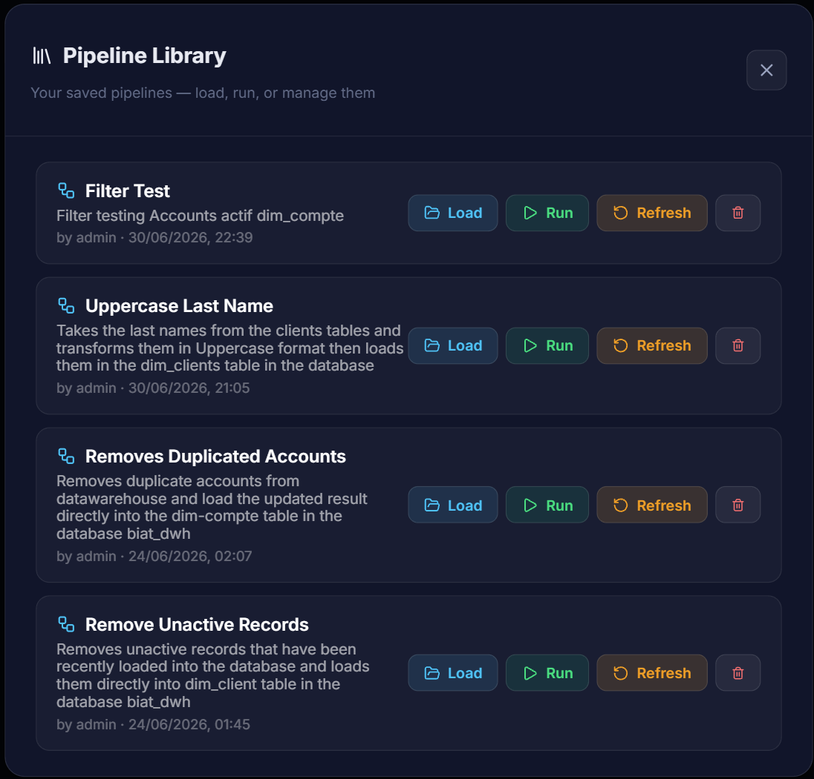
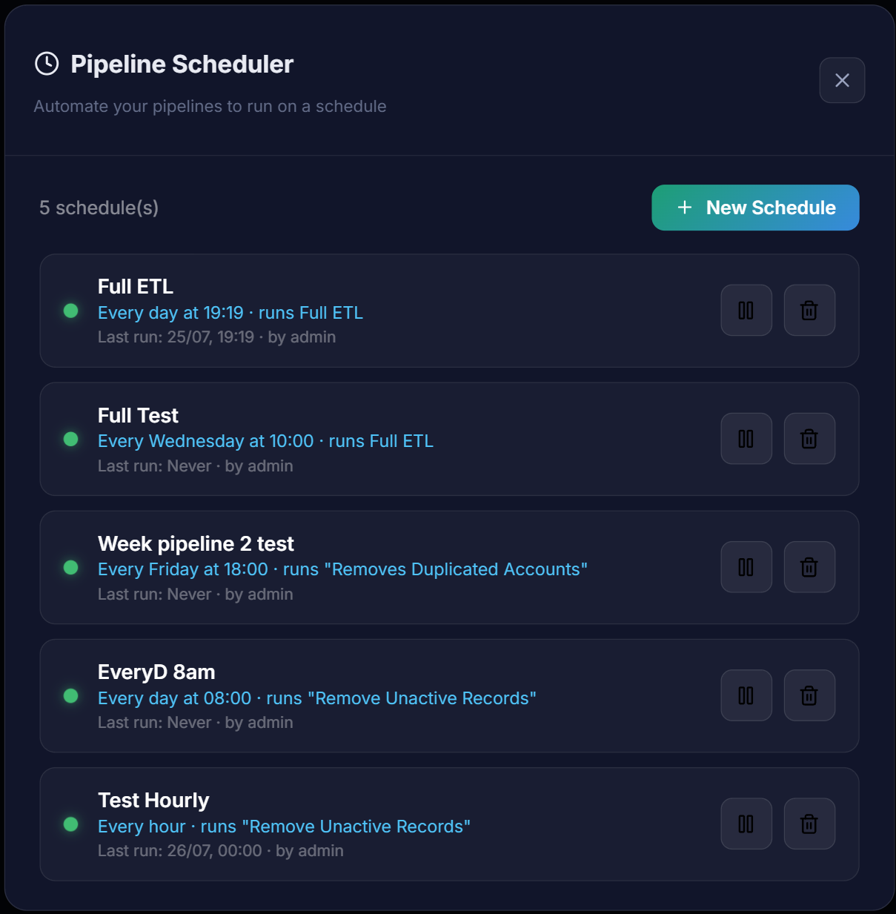
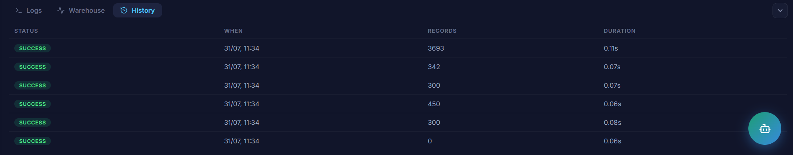
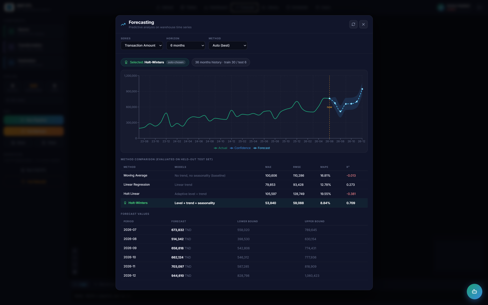

<div align="center">


### Build data pipelines visually. No code required.

A No-Code ETL platform where a visual configuration genuinely generates the SQL that runs — not a mock-up of one.


https://github.com/user-attachments/assets/215589b2-030e-4178-abac-19b5e197b6ac

</div>

---

## What it does

Data engineering has a bottleneck: the people who understand the data usually can't transform it, and the people who can transform it don't always understand the data. Every filter, every rule, every new source becomes a ticket.

**Pipeline Studio removes that step.** You drag three blocks onto a canvas, connect them, configure a filter, and click run. The platform generates the SQL, executes it against the warehouse, and records what happened.

```
CSV / Excel  →  Staging  →  Visual pipeline  →  Star-schema warehouse  →  Dashboard · Forecast · Export
```

---

## The part that matters

Most visual data tools look like this project. The difference is what happens underneath.

**The configuration you set on screen is compiled into the query that executes.** Change one value, and the generated SQL changes with it:

<table>
<tr>
<th width="42%">You configure</th>
<th width="58%">The engine generates</th>
</tr>
<tr>
<td valign="top">



</td>
<td valign="top">

```sql
SELECT s.id_compte, s.id_client,
       s.type_compte, s.date_ouverture,
       s.solde, s.statut
FROM staging.comptes s
WHERE s.statut = 'Actif'
```

</td>
</tr>
</table>

Run it: **35 of 60 accounts loaded.** Change the value to `Inactif` and run again: **25 loaded.**

Two different results from one pipeline. That's the whole proof — a hardcoded process can only ever produce one.

<div align="center">

<sub><i>Source → Transformation → Destination. Each block shows whether it's configured.</i></sub>
</div>

---

## Features

| | |
|---|---|
| **Visual pipeline builder** | Drag source, transformation and destination blocks onto a canvas and connect them. Each block shows its configuration state at a glance. |
| **Real transformation engine** | Row filtering (7 operators), null handling (drop or substitute), value transformation (uppercase, lowercase, trim, round). Every configuration compiles to SQL. |
| **Live SQL preview** | The generated clause appears in the config panel as you type, produced by the same code that builds the executed query. |
| **Schema-flexible import** | Drop a CSV whose columns don't match the internal model and map them visually. Exact-name matches are pre-filled. |
| **Two load modes** | Incremental (`WHERE NOT EXISTS`, no duplicates) or full refresh (reprocess everything, so rule changes apply retroactively). |
| **Automated scheduling** | Save a pipeline and run it hourly, daily or weekly in a background thread — no open browser required. |
| **Analytics dashboard** | Five KPIs with period-over-period growth, monthly evolution, four decompositions, top-accounts ranking. All aggregation in SQL. |
| **Time-series forecasting** | Four methods compared on held-out data, with automatic per-series model selection. |
| **Export** | Any table to CSV; the dashboard and forecasts to multi-sheet Excel workbooks. |
| **Role-based access** | Viewer, Operator, Admin. Enforced server-side on every protected endpoint. |
| **Execution journal** | Every run — manual or scheduled — recorded with status, duration and row count. |

<table>
<tr>
<td width="50%" valign="top">

<sub><i>KPIs with period-over-period growth, aggregated in SQL.</i></sub>
</td>
<td width="50%" valign="top">

<sub><i>Live row counts, read from the database on each display.</i></sub>
</td>
</tr>
</table>

---

## Automation and traceability

Building a pipeline once is the easy part. The harder problems are the ones that surface afterwards: pipelines that live only in someone's head, treatments triggered by hand and occasionally forgotten, and no record of what ran, when, or with what result.

In a banking environment that last point isn't a convenience. **Auditability is a regulatory expectation**, and a data flow that leaves no trace fails it regardless of how correct its output is.

Three capabilities address this.

**Pipelines become durable assets.** A pipeline saved from the canvas is stored as a JSONB document containing its blocks, links, configuration *and* canvas positions — so loading it restores the exact arrangement its author built, not just the logic. The stored object is precisely what the engine interprets, which means the saved pipeline and the executed one cannot drift apart.

**Execution becomes automatic.** A schedule references a saved pipeline and runs it hourly, daily or weekly in a background thread, independent of any open browser. Schedules persist in the database and are reloaded when the server restarts. This is also why persistence comes first: a schedule can't reference a canvas, which is a transient state of the interface.

<table>
<tr>
<td width="50%" valign="top">

<sub><i>Saved pipelines with author and creation date. Load back onto the canvas, run directly, or delete.</i></sub>
</td>
<td width="50%" valign="top">

<sub><i>Schedules bound to a saved pipeline, described in plain language, with last-run time.</i></sub>
</td>
</tr>
</table>

**Every execution leaves a record.** The journal captures status, timestamp, records processed and duration — for manual and scheduled runs alike, in the same place. The entry is written by the engine rather than by the interface, so an execution cannot happen without being recorded.

<div align="center">

<sub><i>Manual and automated runs in one journal. Nothing executes silently.</i></sub>
</div>

The result is that three questions have answers at any moment: **what data flows exist**, **when did each last run**, and **what did it do**. None of them had one before.

---

## Forecasting

The platform forecasts three warehouse series. Rather than picking a method and hoping, it **compares four and selects per series on measured accuracy.**

Parameters are tuned on a validation window carved out of training data — never on the test set. Metrics below come from 6 months the models never saw.

**Transaction volume**

| Method | Models | MAE | RMSE | MAPE | R² |
|---|---|---|---|---|---|
| Moving average | nothing (baseline) | 11.26 | 13.14 | 10.61% | −0.046 |
| Linear regression | trend | 8.55 | 10.50 | 7.81% | 0.332 |
| Holt | level + trend | 15.43 | 17.44 | 15.02% | −0.843 |
| **Holt-Winters** | **+ seasonality** | **4.54** | **6.22** | **3.88%** | **0.766** |

**Three findings worth noting:**

More structure modelled means better accuracy — but only on seasonal series. Holt *underperforms simple regression* here, because it weights recent observations heavily and recent points sit inside a seasonal phase, so it extrapolates a December peak as a permanent trend.

And critically: **a different series picks a different winner.** Account openings have strong trend but weak seasonality, so Holt-Winters estimates a seasonal component from noise and degrades to R² −0.441, while Holt wins at +0.288. No method is universally best, which is exactly why the selection is automatic.

<div align="center">

<sub><i>History, projection with confidence band, and the four-method comparison the selection is based on.</i></sub>
</div>

---

## Demo

https://github.com/user-attachments/assets/a996b001-21ff-4f03-9174-bae655c787c7

---

## Architecture

Three tiers, with all business logic on the server. The interface describes an intention; the server decides whether and how to satisfy it.

```
┌──────────────────┐     HTTP / JSON      ┌──────────────────┐      SQL       ┌──────────────────┐
│  PRESENTATION    │  ─────────────────>  │  BUSINESS LOGIC  │  ───────────>  │       DATA       │
│                  │   + Bearer token     │                  │                │                  │
│  React           │                      │  FastAPI         │                │  PostgreSQL 16   │
│  React Flow      │                      │  SQL generator   │                │                  │
│  Recharts        │                      │  APScheduler     │                │  staging         │
│                  │                      │  Forecasting     │                │  datawarehouse   │
└──────────────────┘                      └──────────────────┘                └──────────────────┘
```

**Backend modules**

| Module | Responsibility |
|---|---|
| `main.py` | API endpoints, role verification, dashboard queries, exports |
| `transformations.py` | Builds the transformed SELECT from user configuration |
| `pipelines.py` | Graph traversal, execution orchestration, persistence |
| `scheduler.py` | Background job registration and execution |
| `forecasting.py` | Series extraction, four methods, metrics, model selection |
| `auth.py` | Password hashing, token issuing, user management |

**Data model** — a star schema: one fact table (`fait_transactions`) at transaction grain, surrounded by four dimensions (client, account, branch, date). Surrogate keys are resolved at load time through joins, including the branch key, which isn't in the source at all and is derived via the client's city.

---

## Security notes

Worth being explicit, since this is a portfolio project:

**What's implemented.** Passwords hashed with bcrypt (per-password salt, configurable cost). Stateless JWT authentication. Role checks server-side at every protected endpoint — the UI adapts to the role for convenience, but that's guidance, not protection. SQL injection prevented by whitelisting columns/operators/operations server-side, type-checking and escaping free values, and keeping query structure entirely server-determined. Exportable tables are whitelisted.

**What isn't.** No HTTPS. No token revocation. No password policy. Secrets live in `.env` rather than a secrets manager. See [Limitations](#limitations).

---

## Getting started

**Requirements:** Python 3.11+, Node.js 16+, PostgreSQL 16+

```bash
git clone https://github.com/aminehaddad-git/pipeline-studio.git
cd pipeline-studio
```

**1 — Database**

```sql
CREATE DATABASE pipeline_studio;
\c pipeline_studio
CREATE SCHEMA staging;
CREATE SCHEMA datawarehouse;
```

**2 — Backend**

```bash
cd backend
cp .env.example .env        # then edit .env with your credentials
pip install -r requirements.txt
python create_users.py      # creates admin / operator / viewer accounts
python -m uvicorn main:app --reload
```

Interactive API docs: **http://localhost:8000/docs**

**3 — Frontend**

```bash
cd ../nocode-interface
npm install
npm start
```

Opens at **http://localhost:3000**

**4 — Sample data**

```bash
cd ../data
python generate_data.py
```

Generates 300 clients, 10 branches, 450 accounts and ~2,900 transactions across 36 months, with a built-in growth trend and annual seasonality — enough structure for the forecasting module to be exercised meaningfully. Import the CSVs through **Upload Data**, then run a full load.

---

## Tech stack

**Backend** — Python · FastAPI · psycopg2 · APScheduler · pandas · openpyxl · python-jose · passlib/bcrypt

**Frontend** — React · React Flow · Recharts · PapaParse · lucide-react

**Database** — PostgreSQL 16 (two schemas, JSONB pipeline storage)

Forecasting is implemented in pure Python from the published equations — no statsmodels, no Prophet. That was deliberate: four textbook algorithms didn't justify a heavy dependency, and implementing them meant being able to explain every line.

---

## Limitations

Stated plainly, because a portfolio project that claims perfection isn't credible.

**Testing** — no automated test suite. Validation was 26 manual functional scenarios. This is the first thing I'd change.

**Scale** — validated on ~3,700 records, untested beyond. The mapped import inserts row by row; at 100k rows it would need batch insertion or `COPY`.

**Concurrency** — single-user only. Two operators running a full refresh simultaneously is undefined behaviour.

**Deployment** — development-grade. No HTTPS, secrets in `.env`, no process supervision.

**Functional gaps** — no aggregation transformation, no joins between sources within one pipeline, no database or API connectors.

**Forecasting** — 36 monthly points is a short series. No ARIMA. And the methods were validated on synthetic data whose trend and seasonality I designed, which demonstrates the pipeline works rather than that it would predict real behaviour.

**Assistant** — keyword-based intent matching, not a language model. Chosen for determinism.

---

## Background

Built as a final-year project during an internship in the IT department of a Tunisian bank, in a Business Intelligence track. The brief was to make data integration accessible to non-technical users while preserving the governance and traceability a banking environment requires.

All data in this repository is **synthetic**. No production data was used at any point.

Four reference ETL jobs were first built in Talend Open Studio, which established the baseline this platform was measured against — and made the case for it. Changing a single filter there meant opening a desktop studio, locating a component, editing an expression, redeploying, and verifying in a separate tool. Here it's four clicks.

---

## License

MIT — see [LICENSE](LICENSE).

---

<div align="center">

**Mohamed Amine Haddad**

[GitHub](https://github.com/aminehaddad-git) · amine.hadded.pro@gmail.com

</div>
